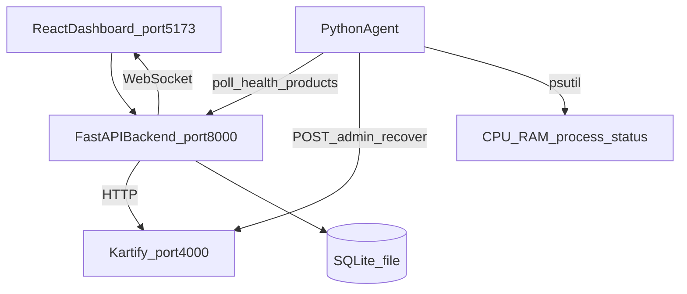
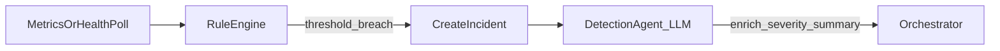
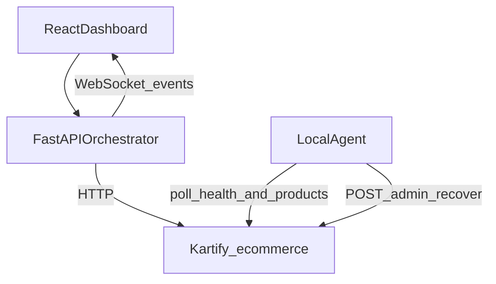

# AegisOps Plan Review (Hackathon Scope)

## Verdict

[plan.md](plan.md) is a **strong product/architecture document** — clear vision, good security model (runbook engine, no arbitrary shell), explicit incident states, and a sensible tech stack. The repo contains [plan.md](plan.md) and **[kartify/](kartify/)** — a real Node.js e-commerce app to use as the monitored target (no separate demo API needed).

For a **1–3 day hackathon**, the plan is **too broad as written**. Cut scope to one scenario, one recovery action, **local processes only (no Docker)**, and **Kartify as the app under test**. Everything else becomes "post-demo."

---

## Monitored App: Kartify (Confirmed)

Instead of building a custom `demo/api/`, AegisOps monitors **[kartify/](kartify/)** — your existing Flipkart-style e-commerce app.

### What Kartify already provides

| Feature | Kartify today |
|---------|---------------|
| Stack | Node.js `http` module, zero npm deps |
| Start command | `node server/server.js` |
| Port | **4000** (via `PORT` env or default) |
| Key endpoints | `GET /api/products`, `POST /api/orders`, auth, cart |
| Admin auth | `x-admin-key: admin123` (already in server.js) |
| Live demo | [kartify-theta.vercel.app](https://kartify-theta.vercel.app) |

### Small hooks to add to Kartify (~30 lines in server.js)

Kartify has no `/health` or failure simulation yet. Add three routes protected by the existing `ADMIN_KEY`:

```javascript
// In-memory failure flag (cleared by recover or process restart)
let failureMode = false;

// GET /health — used by AegisOps agent for detection + verification
// POST /admin/simulate-incident — sets failureMode=true, returns 500s on /api/products
// POST /admin/recover — sets failureMode=false (runbook target)
```

When `failureMode` is true:
- `GET /api/products` returns **500** with `{ error: "Database connection pool exhausted" }`
- `console.error` logs realistic errors for the Investigation Agent
- `GET /health` returns `{ status: "unhealthy", service: "kartify" }`

When recovered:
- All endpoints work normally
- `GET /health` returns `{ status: "ok", service: "kartify" }`

### Hackathon scenario with Kartify

```text
Normal:  GET /api/products → 200, product catalog loads
Trigger: AegisOps dashboard [Simulate Incident] → POST /admin/simulate-incident
Failure: GET /api/products → 500, logs show connection pool errors
Detect:  Agent polls /health + /api/products every 5s
Fix:     Runbook restart_backend → POST /admin/recover
Verify:  /health ok, /api/products returns 200 again
```

**Service name in incidents:** `kartify` (not `payment-api`)

**Root cause narrative:** "JSON file store read failure / connection pool exhausted" — fits the simulated error message even though Kartify uses file-backed storage.

### Updated local process layout

| Process | How to run | Port |
|---------|------------|------|
| **Kartify** | `node kartify/server/server.js` | 4000 |
| AegisOps Backend | `uvicorn backend.app.main:app --port 8000` | 8000 |
| AegisOps Agent | `python agent/main.py` | — |
| React Dashboard | `npm run dev` | 5173 |

Agent config points at `KARTIFY_URL=http://localhost:4000`.

---

## Deployment: No Docker (Confirmed)

**Yes — AegisOps works without Docker.** Docker was a convenience for isolation; it is not required for the core incident loop.

### What runs locally (4 terminals or one `start.ps1` script)

| Process | How to run | Port |
|---------|------------|------|
| Kartify | `node kartify/server/server.js` | 4000 |
| AegisOps Backend | `uvicorn backend.app.main:app --port 8000` | 8000 |
| AegisOps Agent | `python agent/main.py` | — |
| React Dashboard | `npm run dev` | 5173 |

### Prerequisites (no Docker)

- Python 3.11+
- Node.js 18+
- **SQLite** (built into Python — no separate DB install needed for hackathon)

Optional later: swap SQLite → local PostgreSQL with zero code changes if using SQLAlchemy.

### No-Docker architecture



### What changes vs the Docker plan

| Docker version | No-Docker + Kartify replacement |
|----------------|------|
| Custom demo-api | **Kartify** at `localhost:4000` |
| `docker restart demo-api` | Runbook → `POST http://localhost:4000/admin/recover` |
| `docker logs demo-api` | Agent captures Kartify stdout or tails a log file |
| Container status check | `psutil` — is `node server/server.js` process running? |
| PostgreSQL container | SQLite file at `backend/aegisops.db` |
| `docker-compose up` | `scripts/start.ps1` launching Kartify + backend + agent + frontend |

### Recommended runbook for no-Docker demo

Prefer **`recover_backend`** over literal process restart for hackathon reliability:

1. Simulate sets in-memory failure flag via `POST /admin/simulate-incident`
2. Runbook calls `POST /admin/recover` (clears flag — service heals instantly)
3. UI still shows "Action: restart_backend" — the runbook name stays the same; implementation maps to the recover endpoint

This avoids subprocess management bugs on Windows and keeps the demo reliable on stage.

### Tradeoffs

| Pro | Con |
|-----|-----|
| Faster setup — no Docker Desktop install | Less "production-like" isolation |
| Works on any Windows/Mac/Linux with Python + Node | Can't demo container orchestration |
| SQLite = zero DB setup | PostgreSQL-specific features deferred |
| Easier debugging (run each service in its own terminal) | Agent and demo API share the same host |

Docker can be added **post-hackathon** as an optional `docker-compose.yml` without changing the core architecture.

---

## What the Plan Gets Right

- **North-star loop is correct:** Detect → Investigate → Diagnose → Safety → Act → Verify → Learn
- **Security model is production-minded:** LLM proposes actions; a fixed runbook engine executes them — never raw shell from the model
- **Explicit incident state machine** ([plan.md](plan.md) §7–8): avoids "LLM conversation as state"
- **Phased delivery** ([plan.md](plan.md) §19): good mental model, but phases should be compressed into ~3 hackathon sprints
- **"What NOT to build"** ([plan.md](plan.md) §21): excellent guardrails — keep these

---

## Gaps and Inconsistencies to Fix Before Building

### 1. Scope conflict: 1 demo vs 3 scenarios

| Section | Says |
|---------|------|
| §9–10 | One scenario: DB pool exhaustion → restart backend |
| §22 | Three scenarios: crash, 500 errors, disk full |
| §25 step 20 | Remote VPS deployment |

**Hackathon decision:** Ship **only Scenario 1** (backend crash / 500 errors → `restart_backend`). Stub the other two in UI copy only.

### 2. Knowledge Agent timing is contradictory

- Orchestrator diagram (§7): Knowledge runs **before** Root Cause
- Phase 6 (§19): Knowledge storage comes **after** Verification
- Immediate steps (§25): Knowledge storage at step 17

**Clarification for MVP:**

- **During incident:** Knowledge Agent = PostgreSQL `ILIKE`/full-text search over `knowledge_incidents` (can return empty on first run — that's OK)
- **After resolution:** Write resolved incident to `knowledge_incidents` (the "Learn" step)

Don't build RAG/embeddings in the hackathon.

### 3. Detection: rules vs LLM is unclear

Plan mentions both "detection rules" (Phase 2) and "Detection Agent" (Phase 3).

**Hackathon split:**



- **Rules detect** (fast, reliable, no API cost): error rate > 5%, health != 200, demo-api process not running
- **Detection Agent (LLM)** only **summarizes/enriches** the incident after creation — don't depend on LLM for the initial trigger

### 4. Who executes runbooks?

**Local hackathon architecture (no Docker):**



- **Agent** polls Kartify `/health` and `/api/products`, captures console errors, and executes runbooks via `POST /admin/recover`
- **Backend** owns orchestration, LLM calls, incident state, and WebSocket fan-out
- Backend calls demo API directly for verification; agent handles remediation execution

### 5. Redis and Prometheus/Grafana — defer

Listed in stack (§17) but no concrete use case.

| Component | Hackathon (no Docker) |
|-----------|-----------|
| Redis | Skip — use in-process asyncio + SQLite |
| Prometheus/Grafana | Skip — agent polls `/health` + tails log file |
| SQLite | Required (zero install) |
| PostgreSQL | Optional upgrade post-hackathon |

Add these in post-hackathon Phase 2.

### 6. Demo API failure mode must be designed for restart recovery

§9 says "DB connection pool exhausted" but the fix is `restart_backend`. **The simulated failure must be recoverable**, e.g.:

- Demo API holds an in-memory `failure_mode` flag set by `POST /admin/simulate-incident`
- Runbook calls `POST /admin/recover` (or restarts the uvicorn process) → flag clears → health returns 200
- Logs emit realistic `connection pool exhausted` errors while flag is set

Without this, the demo loop breaks at Verification.

### 7. Missing from plan (add during build)

- **LLM provider config** — see recommendations below
- **Structured output contract** — Pydantic schemas per agent; validate JSON before state transitions
- **WebSocket event schema** — e.g. `{ type, incident_id, agent, payload, ts }`
- **Orchestrator implementation** — simple Python state machine (dict of handlers per status), not a multi-agent framework
- **Idempotency** — don't re-run Action Agent if incident is already REMEDIATING

---

## LLM Strategy: Gemini + OpenRouter

### Primary: Google Gemini

Use **Gemini 2.0 Flash** via [Google AI Studio](https://aistudio.google.com/) (free tier, fast, good JSON mode).

```python
# backend/app/services/llm.py — abstraction pattern
LLM_PROVIDER=gemini  # gemini | openrouter
GEMINI_API_KEY=...
OPENROUTER_API_KEY=...
OPENROUTER_MODEL=google/gemma-2-9b-it:free  # fallback
```

Use Gemini's **JSON / structured output** mode with Pydantic response schemas for each agent.

### Fallback: OpenRouter free models

Good free OpenRouter options for structured agent output (verify availability at [openrouter.ai/models](https://openrouter.ai/models) — filter by `:free`):

| Model | Use case |
|-------|----------|
| `google/gemma-2-9b-it:free` | Best free fallback for investigation/root-cause |
| `meta-llama/llama-3.2-3b-instruct:free` | Lightweight detection summaries |
| `qwen/qwen-2-7b-instruct:free` | Alternative if Gemma rate-limits |

**Hackathon tip:** Implement a single `LLMClient` with provider swap. If Gemini rate-limits during demo, flip env var to OpenRouter without code changes.

**Do NOT** use free models for Safety Agent critical decisions without validation — keep the **runbook allowlist** as the real safety gate; LLM only ranks/explains.

---

## Hackathon MVP Definition (Revised)

Ship when this works **live on stage in under 60 seconds**:

```text
Click [Simulate Incident]
  → Rule engine creates INC-1001 (DETECTED)
  → Agents run sequentially (~5–15s total with Flash)
  → Safety approves restart_backend (LOW, auto)
  → Agent calls POST /admin/recover on demo API
  → Verification: health=200, error_rate < 1%
  → Status = RESOLVED, timeline visible in dashboard
  → Incident saved to knowledge_incidents
```

**Out of scope for hackathon:**

- Remote VPS agent (§15, §25 step 18–20)
- Scenarios 2–3 (§22)
- Human approval UI (auto-approve LOW only; stub Approve/Reject buttons)
- Prometheus/Grafana, Redis, RAG/embeddings
- MTTD/MTTR metrics dashboard (nice-to-have if time permits)

---

## Compressed Build Order (3 Days)

### Day 1 — Skeleton + Detection

Repo structure per [plan.md](plan.md) §18 (trimmed):

```text
AegisOps/
├── kartify/                   # existing monitored app (add 3 admin routes)
├── backend/app/{api,agents,orchestrator,models,schemas,services,runbooks,websocket}
├── agent/{collectors,actions,main.py}
├── frontend/src/{pages,components,hooks,services,types}
├── scripts/start.ps1
├── scripts/start.sh
└── .env.example
```

Deliverables:

1. **Kartify hooks:** `/health`, `/admin/simulate-incident`, `/admin/recover` in [kartify/server/server.js](kartify/server/server.js)
2. `scripts/start.ps1` + `scripts/start.sh`: launch Kartify, backend, agent, frontend
3. FastAPI: health, incidents CRUD, WebSocket `/ws/incidents`
4. SQLite schema: incidents, events, agent_runs, remediation_actions, verification_results, knowledge_incidents
5. Rule-based detector: poll `http://localhost:4000/health` every 5s
6. React: Dashboard + Incident Detail + Live Timeline + [Simulate Incident] button

**Day 1 exit criteria:** Click simulate → incident appears in UI with DETECTED status and timeline event.

### Day 2 — AI Pipeline + Runbooks

1. `LLMClient` (Gemini primary, OpenRouter fallback)
2. Agent modules with Pydantic I/O: `detection`, `investigation`, `knowledge`, `root_cause`, `safety`
3. Orchestrator state machine driving agent sequence
4. Runbook engine: `restart_backend` → agent calls `POST http://localhost:4000/admin/recover` with `x-admin-key`
5. Persist every agent run to `agent_runs` + emit WebSocket events

**Day 2 exit criteria:** Full agent chain runs; root cause + recommended action appear in UI.

### Day 3 — Action, Verify, Polish

1. Action Agent + safety policy (allowlist: `restart_backend` only)
2. Verification Agent: poll health 3x over 10s, compare error rate before/after
3. On RESOLVED → insert into `knowledge_incidents`
4. Dashboard polish: agent activity checklist, severity badges, simulate button
5. Seed 2–3 fake past incidents in `knowledge_incidents` so Knowledge Agent demo isn't empty
6. End-to-end rehearsal (run 5x reliably)

**Day 3 exit criteria:** One-click demo works 5 times in a row without manual intervention.

---

## Key Implementation Details

### Orchestrator state machine

```python
# Pseudocode — backend/app/orchestrator/engine.py
TRANSITIONS = {
  "DETECTED": run_detection_agent,
  "INVESTIGATING": run_investigation_agent,
  "DIAGNOSING": [run_knowledge_agent, run_root_cause_agent],
  "SAFETY_REVIEW": run_safety_agent,
  "REMEDIATING": run_action_agent,
  "VERIFYING": run_verification_agent,
  "RESOLVED": store_knowledge,
}
```

Run as asyncio background task per incident. Emit WebSocket event after each step.

### Agent prompt pattern

Each agent receives: `{ incident, prior_agent_outputs, telemetry_snapshot }` and returns validated Pydantic model. Keep prompts in `backend/prompts/*.txt`.

### Security (keep from plan, simplify for demo)

- Allowlist: `ALLOWED_ACTIONS = {"restart_backend"}`
- Safety Agent output is advisory; orchestrator checks allowlist + risk level
- LOW risk → auto-execute; MEDIUM/HIGH → log only (no UI needed for hackathon)

### WebSocket events (minimum schema)

```json
{
  "type": "agent.completed",
  "incident_id": "uuid",
  "agent": "root_cause",
  "status": "DIAGNOSING",
  "payload": { "root_cause": "...", "confidence": 0.94 },
  "timestamp": "ISO8601"
}
```

---

## Recommended Edits to plan.md (Post-Hackathon)

After the demo works, update [plan.md](plan.md) to:

1. Add **"Hackathon MVP"** subsection under §20 with explicit defer list
2. Resolve Knowledge Agent timing (§7 vs §19)
3. Document **agent vs backend responsibilities** (§5)
4. Specify **demo failure mode contract** (§9)
5. Add **LLM provider section** (Gemini + OpenRouter)
6. Mark §22 Scenarios 2–3 and §25 steps 18–20 as **Phase 2**

---

## Risk Register

| Risk | Mitigation |
|------|------------|
| LLM latency blows demo timing | Use Gemini Flash; cap agent count; pre-warm on app start |
| LLM returns invalid JSON | Pydantic validation + 1 retry with "fix your JSON" prompt |
| Docker restart doesn't fix demo | Use `/admin/recover` endpoint instead of process restart |
| WebSocket drops during demo | Frontend polls `/incidents/{id}` as fallback |
| OpenRouter free model rate limits | Gemini primary; seed responses for rehearsal mode env flag |

---

## Summary

The plan is **ready to build from**, but needs **ruthless scoping** for a hackathon. Focus on the §9–10 single scenario adapted for **Kartify**, **local processes (no Docker)**, SQLite, Gemini 2.0 Flash with OpenRouter free fallback, and one runbook (`restart_backend` → Kartify `/admin/recover`). The first milestone from §25 is exactly right:

> Break a real service → AegisOps investigates → one safe predefined recovery → prove recovery.

Everything else in the 1300-line plan is the product roadmap, not the hackathon deliverable.
